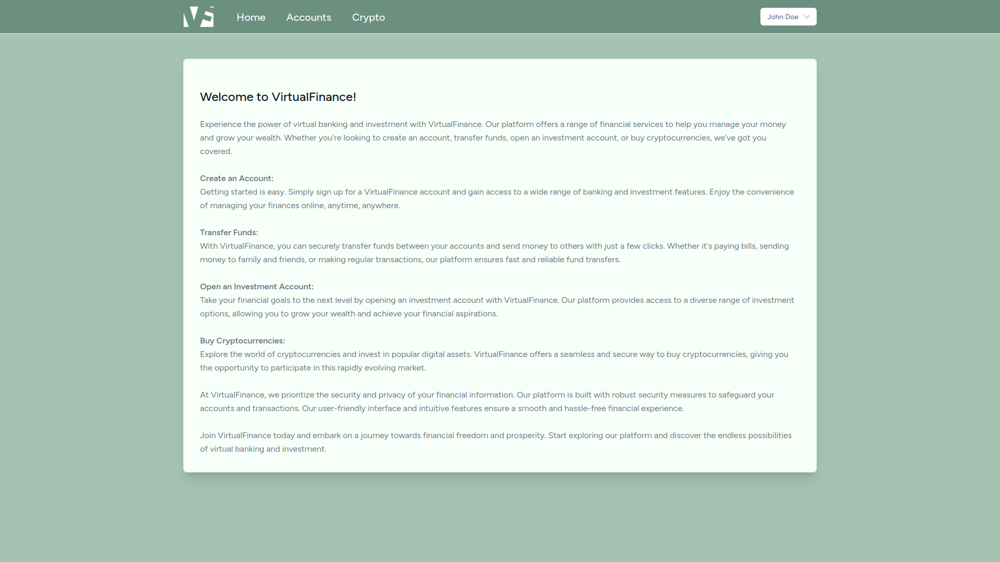

# VirtualFinance - Online Banking System with Crypto Investment Platform

  

VirtualFinance is a web-based online banking system with a crypto investment platform built using Laravel Framework 10.13.5. It provides users with the ability to manage their finances, make transactions, and invest in cryptocurrencies easily. The platform uses Tailwind CSS for styling and Fortify for authentication, ensuring a seamless and secure user experience.

Check out the live demo of VirtualFinance at http://virtualfinance.wip.la/. Feel free to register and explore the platform. Upon creating an account, you will receive 10,000 units of your chosen currency to test out the functionalities.

## Features

- **User Authentication**: Utilizing Laravel Fortify, VirtualFinance ensures secure user registration and authentication.

- **Account Management**: Users can manage their accounts, view transaction history, update and delete the account.

- **Crypto Investment**: VirtualFinance offers a user-friendly interface for investing in cryptocurrencies and tracking investments.

- **Transaction Handling**: Users can easily transfer funds to other users and external accounts, ensuring smooth financial transactions.

- **Balance Management**: The platform enables users to check account balances and track their financial health.

## Screenshots

## Technologies used

- **Laravel** Framework 10.13.5
- **Tailwind** CSS
- **PHP** 8.2
- **MySQL** 8.0.33
- **Composer**
- **Node.js** 18.16.1

## Installation

To set up VirtualFinance locally, follow these steps:

1. Clone the repository: `git clone https://github.com/Zaaliitis/VirtualFinance.git`
2. Change into the project directory: `cd VirtualFinance`
3. Install the project dependencies: `composer install` `npm install` `npm run build` 
4. Register in [Coin Market Cap API](https://coinmarketcap.com/api/) to get an API key.
5. Copy the `.env.example` file and configure your environment variables: `cp .env.example .env`
6. Generate the application key: `php artisan key:generate`
7. Set up your database and update the `.env` file with the database credentials.
8. Run database migrations: `php artisan migrate`
9. Start the development server: `php artisan serve`
10. Enjoy!

Thank you for checking out VirtualFinance! 
